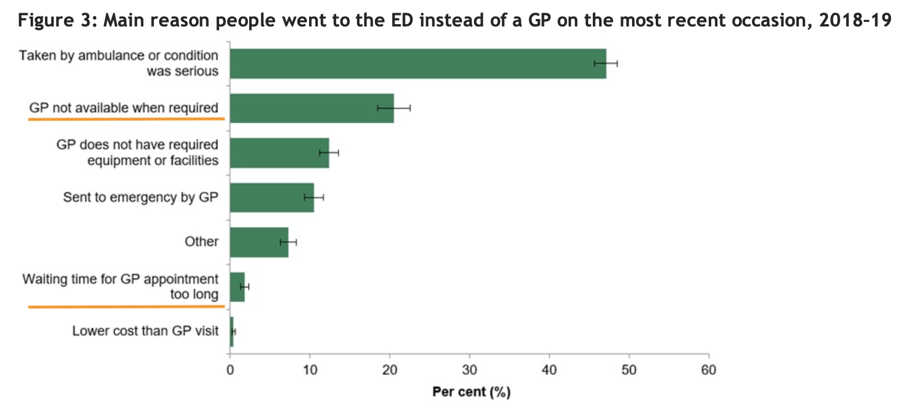

# #GovHack2022: V Care

#GovHack2022 MATRIX - Project 1927

Challenge: [Meeting short term health needs outside of a hospital](https://hackerspace.govhack.org/challenges/meeting_short_term_health_needs_outside_of_a_hospital)

## Problem Statement

> *How can we use available technologies to support people’s health needs and stay out of hospital?*

> There is ever increasing pressure on hospital Emergency Departments. Some hospitals have a GP service on site to try and reduce this pressure for those people with minor ailments, however this is not the only solution.
In addition, during the recent pandemic, it was important to minimise the number of people coming to hospitals to reduce risks related to COVID infection.
What technology options could enable people to manage their health and wellness without attending a hospital?

## Pain Points

* Low urgency care uses precious hospital capacity.
* During outbreaks, hospitals are locations with high infection risk
* Chronic condition care, vaccine preventable disease, acute conditions and early action identified as being primary categories for potentially preventable hospitalisation and avoiding emergency departments for low urgency care. This is more prevalent in communities with less access to GPs and other health care facilities.

### Anecdotes

<a href="https://github.com/miloaissatu/govhack2022_vcare/blob/main/Datasets/aihw-chc-8.pdf">Coordination of health care: patient and primary care factors associated with potentially preventable hospitalisations for chronic conditions</a>

  > The findings of our study are consistent with other studies, which also find that the health of individuals is the most important factor driving PPH admissions (Falster et. al. 2015, Tran et. al. 2014, Khanna, et. al. 2019, Youens et. al., 2019), but they also point to the importance of access to GPs in chronic condition management. Barriers to access such as cost or poor GP availability does not differ substantially by hospitalisation type (or for those without hospitalisations).

<a href="https://github.com/miloaissatu/govhack2022_vcare/blob/main/Datasets/aihw-hpf-50.pdf">Disparities in potentially preventable hospitalisations across Australia, 2012–13 to 2017–18</a>

  > The report confirms findings from previous studies, showing that between 2012–13 and 2017–18: 
  > 
  > ...
  > 
  > • PPH rates were substantially higher for Indigenous Australians than for Other
Australians.
  >
  > • PPH rates increased with increasing socioeconomic disadvantage and remoteness.
  >
  > ...
  >
  > This report has further observed that between 2012–13 and 2017–18:
  >
  > • Hospitalisations for Pneumonia and influenza (vaccine-preventable) had a substantial impact on PPH rates.
  >
  > ...
  >
  > • Some PPH conditions showed predictable seasonal trends that can be incorporated into
management strategies.

<a href="https://github.com/miloaissatu/govhack2022_vcare/blob/main/Datasets/Use-of-emergency-departments-for-lower-urgency-care-2015-16-to-2018-19.pdf">Use of emergency departments for lower urgency care: 2015–16 to 2018–19 (No NT data, proxy)</a>

  > Findings confirm that people living in regional PHN areas continue to have a higher rate of lower urgency ED presentations (164 presentations per 1,000 people in 2018−19) than their metropolitan counterparts (90 per 1,000 people).
  >
  > ...
  > 
  

<a href="https://github.com/miloaissatu/govhack2022_vcare/blob/main/Datasets/aihw-chc-4.pdf">Coordination of health care: experiences of barriers to accessing health services among patients
aged 45 and over
2016</a>

  > One of the most commonly reported reasons for not seeing a GP when needed was that there was no appointment available. There are potential flow-on effects of not being able to see a GP when needed because of long waiting times, or not being able to get an appropriate appointment time.
  > 
  > Not being able to get an appointment when needed can be associated with increased emergency department use. A study of unnecessary use of emergency departments by older people in Adelaide found that the lack of availability of GP services appeared to be a contributing factor to presenting at an emergency department (Faulkner & Law, 2015). The patient responses in that study potentially highlight a difficulty in obtaining an appropriate GP appointment time when needed, which is consistent with the findings of this report.
  >
  > ...
  > 
  > Patients living in Remote and very remote areas were more likely than those in Major cities to report that the reason for not seeing a GP or specialist was because there were no GPs or specialists nearby. The undersupply and uneven distribution of medical professionals in rural regions is well documented.
  > 
  > ...
  > 
  > This report has found some associations between some patient sociodemographic characteristics and patient-reported barriers to accessing health-care services. But there are also environmental and social factors—such as a lack of culturally acceptable services or long waiting lists or waiting times— beyond a patient’s control that affect access to health care. These many factors all need to be taken into account when developing policies and future plans to address issues of access to health care.

<a href="https://github.com/miloaissatu/govhack2022_vcare/blob/main/Datasets/Potentially-preventable-hospitalisations-in-Australia-by-age-groups-and-small-geograph.pdf">Potentially preventable hospitalisations in Australia by age groups and small geographic areas, 2017–18</a>

  > Around 7% of all hospitalisations were classified as potentially preventable
  >
  > Nearly 10% of all hospital bed days were for potentially preventable hospitalisations
  >
  > There were nearly 748,000 potentially preventable hospitalisations in Australia in 2017–18
  >
  > Rates of potentially preventable hospitalisations varied greatly across local areas

## Idea Proposal

[V CARE.pdf Presentation](./V-CARE.pdf)

[V Care video](./V-CARE.mp4)

V Care puts health care at the fingertips of the community by

* consolidating key health resources and information
* screening questions to advise most suitable care touch point
  * self care / over the counter / pharmacy
  * telephony - nurses
  * telephony/video - doctors
  * nearest clinics, next available appointments
  * emergency department / hospital

* proactive and preemptive care via health bulletins, personalised care prompts

V Care helps the health network by increasing awareness of the community to the resources available to them so as not to strain the Hospital system for concerns that can be managed via other channels. It also helps connect more communities with lesser local health care facilities with existing nationwide resources. 

### Solution Themes

Emphasis on potentially preventable hospitalisations (PPH) and avoidance of Emergency Departments (ED) for lower urgency care through personalised guidance to appropriate care touch points.

* Self-care for acute conditions (pharmacy / over the counter)
* Telephony/video channels for medical consultations with appropriate professional (telehealth nurses / doctors)
* Recommended local medical resources (GP, labs, etc)
* Proactive care/advise for seasonal ailments (vaccination programs)
* Personalised prompts for regular care (chronic conditions, general upkeep e.g. dental care)
* Ease of access to medical advice and resources
* Data gathering from users of platform to inform local initiatives e.g. frequency of mobile clinic/lab visits.

## Interactive Mock-up

https://apps.powerapps.com/play/e/7d9cb689-9338-e90d-80ae-5beb99d6b0ca/a/90b6e49b-ce72-4c2e-a887-ebd8ff4c218b?tenantId=1cb7f187-572f-4926-ab9c-483d8c4c6ee1&source=AppSharedToContributorV2&hint=21aa3f32-ad21-44e6-8170-197ff3ad6f23

Powerapps code: [V-Care_20220821061422.zip](./powerapps/V-Care_20220821061422.zip)

## Datasets

Refer to

* [Matrix Project - Supporting data.pptx](./Matrix_Project-Supporting_Data.pptx)
* [Matrix Project - Supporting data.pbix](./Matrix_Project-Supporting_Data.pbix)
* datasets folder.